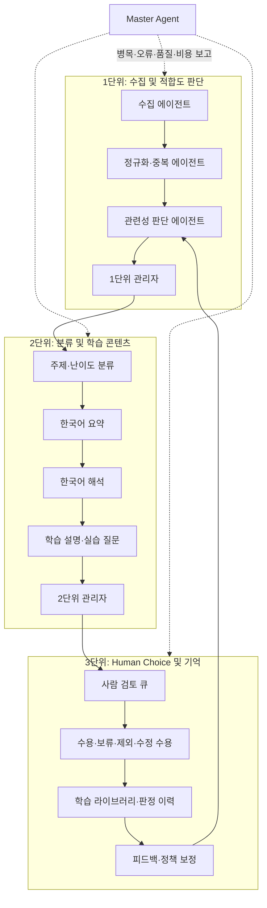

# AI Evals 학습 아카이브 — 아키텍처 검토 및 구축 로드맵

작성일: 2026-09-01  
상태: 설계 검토 완료 · 1단위 구축 대기

## 1. 목표와 범위

이 프로젝트의 목적은 AI 에이전트·LLM·RAG·AI 서비스의 **Evals(검증·평가) 관련 공개 자료**를 수집하고, 사람이 품질을 확인한 뒤 한국어 학습 자료로 축적하는 것이다.

최종 사용자는 다음을 할 수 있어야 한다.

1. 수집된 후보 자료와 원문 근거를 확인한다.
2. 관련성·중복·품질 판정 근거를 확인한다.
3. 한국어 요약, 해석, 실무 설명, 학습 포인트를 읽는다.
4. 사람의 판단으로 수용·보류·제외·수정 수용을 결정한다.
5. 수용한 자료만 학습 라이브러리에서 탐색·학습한다.

현재 공개된 검토 대시보드는 **UI 프로토타입**이다. 자동 수집, 예약 실행, LLM 생성은 의도적으로 제거되어 있으며 예시 자료만으로 검색·필터·수용/제외 흐름을 보여 준다.

## 2. 지금까지 확인한 문제

### 기존 수집 서비스 코드의 주요 위험

| 우선순위 | 문제 | 영향 | 수정 방향 |
|---|---|---|---|
| 높음 | 기사 저장 뒤 Markdown/파일 저장이 실패하면 후속 실행에서 중복으로 제외될 수 있음 | 자료가 학습 문서에 영구히 누락될 수 있음 | 작업 상태와 outbox/recovery 경로 도입 |
| 높음 | 수동 수집·예약 생성·중지를 로그인 사용자 모두 수행 가능 | 일반 사용자가 전역 운영 상태를 변경할 수 있음 | 관리자 역할과 운영 권한 분리 |
| 높음 | 기본 출처를 매번 `enabled: true`로 upsert | 운영자가 끈 피드가 다시 켜짐 | 신규 삽입 때만 기본 활성화 |
| 중간 | 실행 ledger가 설명한 모든 통계를 DB에 보존하지 않음 | 운영 지표와 문서가 불일치 | 실행·단계별 메트릭 테이블 추가 |
| 중간 | 저장 key의 hash 접미사 설명과 실제 구현이 다름 | 동시 실행 시 파일명 충돌 위험 | UUID/콘텐츠 hash 기반 object key |
| 중간 | LLM 호출에 전체 시간 예산이 없음 | 재시도·지연이 스케줄러 제한을 넘길 수 있음 | 단계별 timeout, retry budget, circuit breaker |

### 초기 UI의 한계

- 예시 데이터만 존재해 실제 검토 대기열을 확인할 수 없다.
- 수집·적합도·콘텐츠 생성·사람 검토의 상태가 한 화면에서 구분되지 않는다.
- 원문, 한국어 해석, 학습 설명, 모델 근거의 연결이 없다.
- 사람이 내린 판정이 이후 관련성 판단을 개선하는 피드백 구조가 없다.

## 3. 최종 구조: 세 단위와 총괄 관리



### 1단위 — 수집 및 적합도 판단

| 에이전트 | 입력 | 업무 | 출력 |
|---|---|---|---|
| 수집 | 등록된 RSS/Atom/API 출처 | 제목, URL, 날짜, 원문 발췌, 출처 메타데이터 수집 | 후보 자료 |
| 정규화·중복 | 후보 및 기존 자료 | URL 정규화, 제목 정규화, 콘텐츠 hash, 중복·유사 후보 비교 | 신규/중복, 근거 |
| 관련성 판단 | 신규 후보 및 원문 근거 | Evals 직접성, AI 맥락, 평가 방법, 근거 길이 판정 | 적합도 점수·신뢰도·근거 문장 |
| 1단위 관리자 | 단계별 job 상태 | 수집량 편향, 실패, 중복률, 호출 예산 제어 | 다음 구간으로 보낼 우선순위 큐 |

관련성 판단은 최종 수용을 결정하지 않는다. 사람 검토에 앞서 비용이 큰 후속 작업의 우선순위를 정한다.

```ts
type RelevanceAssessment = {
  itemId: string;
  eligibility: "high" | "medium" | "low";
  relevanceScore: number; // 0..100
  confidence: number; // 0..100
  evidence: string[]; // 원문의 직접 근거
  matchedTopics: string[];
  uncertaintyReason?: string;
  modelId: string;
  policyVersion: string;
};
```

처리 원칙:

- `high`: 2단위의 전체 콘텐츠 생성을 우선 예약한다.
- `medium`: 짧은 요약·근거만 우선 생성하고 품질 결과에 따라 확대한다.
- `low`: 제외 후보로 기록한다. 단, 사람은 언제든 검토 대상으로 되돌릴 수 있다.
- 원문 근거가 없거나 너무 짧으면 후속 모델 호출을 하지 않는다.

### 2단위 — 분류 및 학습 콘텐츠

| 에이전트 | 업무 | 완료 기준 |
|---|---|---|
| 주제·난이도 분류 | 태그, 대상 역할, 난이도, 예상 읽기 시간 부여 | 태그·난이도 근거가 존재 |
| 요약 | 원문 내 사실만 3~5문장으로 요약 | 원문 밖 단정 없음 |
| 한국어 해석 | 기계 직역이 아닌 자연스러운 이해용 해석 제공 | 핵심 조건·수치·제한 보존 |
| 학습 설명 | 왜 중요한지, 실무 적용, 확인 질문·미니 과제 작성 | 개발자·DS·PM 중 최소 한 역할에 유용 |
| 품질 검수 | 원문 충실성, 번역 누락, 형식 오류, 모델 간 충돌 점검 | 통과/재작업/경고 판정 |

2단위 관리자는 모델별 timeout, 재시도 횟수, 토큰·비용 예산을 관리한다. 한 항목의 생성 실패가 전체 후보를 실패시키지 않으며, 실패한 산출물만 재시도하거나 검토 큐에 경고와 함께 전달한다.

### 3단위 — Human Choice 및 피드백 기억

사람은 다음의 최종 결정을 한다.

- **수용**: 학습 라이브러리에 공개한다.
- **보류**: 추가 원문 확인 또는 재생성이 필요하다.
- **제외**: 학습 목적과 맞지 않거나 근거가 부족하다.
- **수정 수용**: 태그·난이도·해석·설명을 수정한 후 수용한다.

```ts
type HumanFeedback = {
  itemId: string;
  relevanceAssessmentId: string;
  decision: "accepted" | "held" | "rejected" | "accepted_with_edits";
  correctedTopics?: string[];
  correctedDifficulty?: "beginner" | "intermediate" | "advanced";
  feedbackReason?: string;
  reviewerId: string;
  createdAt: string;
};
```

3단위 관리자는 검토 대기 시간, 보류 자료, 사람 수정률, 피드백 누락 여부를 관리한다.

### Master Agent — 총괄 운영

Master Agent는 콘텐츠를 만들지 않는다. 세 단위의 큐·오류·품질·비용을 읽고, 조치가 필요한 운영 이슈를 보고한다.

| 관측 항목 | 경고 예시 | 조치 |
|---|---|---|
| 병목 | 번역 큐 평균 대기 5분 이상 | 동시 처리량 조정, 저비용 모델 fallback |
| 수집 오류 | 특정 피드 timeout이 3회 이상 | 피드 격리, 다음 실행에서 재시도 |
| 품질 | 특정 태그의 사람 수정률 20% 이상 | 분류 정책 검토·재평가 세트 생성 |
| 모델 신뢰도 | 모델 A와 B의 판단 충돌 증가 | 상위 검수 모델 또는 사람 검토 우선 |
| 비용 | 모델별 예산 80% 초과 | noncritical 작업 보류, 모델 등급 하향 |
| 편향 | 특정 출처가 후보의 과반 | 출처별 후보 상한·라운드로빈 적용 |

일일 보고 형식:

```text
수집 80건 / high 적합 14건 / 사람 수용 7건
병목: 한국어 해석 평균 대기 4분
오류: 특정 피드 timeout 3회
품질: RAG 태그 오탐률 18%
권장: RAG 정책 재검토, 해석 모델 동시 처리 2→3 확대
```

## 4. 관련성 피드백과 신뢰도 보정

사람의 최종 판정은 이후 관련성 판단의 피드백 데이터로 저장한다. 그러나 이 피드백으로 자동 수용하지 않는다. 모델이 하는 일은 후보 우선순위를 보정하는 것까지다.

```ts
nextPriority =
  baseRelevanceScore +
  sourceAcceptanceWeight +
  topicAcceptanceWeight +
  modelCalibrationWeight;
```

### 피드백 안전장치

1. 사람의 수용/제외는 다음 후보의 **우선순위**에만 반영한다.
2. 가중치 변화에는 상한을 둔다. 한 번의 판단으로 정책이 크게 바뀌지 않는다.
3. 최소 표본 수를 충족한 출처·주제에만 보정치를 적용한다.
4. 정책은 `policyVersion`으로 저장하고 언제든 이전 버전으로 되돌린다.
5. 활성화 전, 별도 검증 세트에서 수용률·오탐률·미탐률을 비교한다.
6. 한 명의 검토자 또는 한 출처의 편향을 분리해 관측한다.

## 5. 레드팀 검토와 수용한 수정안

| 공격/실패 시나리오 | 위험 | 수용한 방어 설계 |
|---|---|---|
| 홍보성 AI 뉴스가 대량 유입 | 학습 라이브러리 오염 | 제목·원문에 Evals 직접성 근거 요구, low 후보 분리 |
| RSS 본문에 프롬프트 인젝션 문구 포함 | 모델이 데이터 지시를 따름 | 원문은 비신뢰 데이터로 구획, 시스템 지시와 분리, 도구 호출 금지 |
| 모델 환각·번역 왜곡 | 잘못된 학습 자료 | 원문 근거 문장 저장, 품질 검수, 사람의 최종 수용 |
| LLM 장애·429·timeout | 수집 전체 중단 | 단계별 timeout, 지수 backoff, dead-letter queue, fallback |
| 같은 자료의 동시 수집 | 중복 문서·DB 충돌 | canonical URL/content hash unique key, idempotency key, job lock |
| 사람 피드백 편향 | 관련성 모델 왜곡 | 최소 표본, 가중치 상한, 검증 세트, policy version rollback |
| 모델을 너무 많이 병렬 호출 | 비용 폭증·병목 | high/medium/low 단계화, 모델별 concurrency·token budget |
| 공개 대시보드의 검토 기능 노출 | 외부 사용자가 운영 상태 변경 | 읽기 공개와 검토 관리자 권한을 분리 |
| 악성/불안정 출처 | SSRF·파싱 오류·지연 | 허용 목록, URL scheme/host 검증, 응답 크기 제한, parser 격리 |

## 6. 데이터 수집 루트 후보

초기에는 공개 RSS/Atom과 공식 연구/기술 블로그를 우선 사용한다. 수집 전에는 라이선스, robots 정책, 제공 API 약관을 확인한다.

| 우선순위 | 출처 | 용도 | 수집 방식 |
|---|---|---|---|
| 1 | arXiv API | Agent/LLM/RAG evaluation 연구 | Atom API 검색 |
| 1 | AWS Machine Learning Blog | 제품·에이전트 평가 실무 | RSS |
| 1 | Hugging Face Blog | 모델·평가·벤치마크 기술 글 | RSS |
| 2 | OpenAI, Anthropic, Google AI 공식 블로그/문서 | 공식 평가 방법론·제품 공지 | 공식 RSS/API가 있을 때만 |
| 2 | Papers with Code | 벤치마크·논문 탐색 보조 | 공개 API/약관 확인 후 |
| 3 | GitHub release/README | 평가 프레임워크 업데이트 | 허용 repository 목록 기반 |

초기에는 출처 수를 적게 유지하고, 사람 수용률·오탐률을 확인한 뒤 확장한다.

## 7. UI 재설계 원칙과 예시

### 화면 구성

1. **운영 개요**: 수집 성공/실패, 단계별 큐, 병목 경고만 간결하게 표시
2. **검토 큐**: 후보 제목, 출처, 원문 발췌, 적합도 점수, 근거, 생성 상태
3. **자료 상세**: 원문 링크, 핵심 발췌, 한국어 요약, 해석, 학습 설명, 모델 경고
4. **사람 판정**: 수용/보류/제외/수정 수용 및 사유 입력
5. **학습 라이브러리**: 수용된 자료만 태그·난이도·학습 경로로 탐색
6. **운영 보고**: Master Agent의 병목·품질·비용·오류 보고

### 검토 큐의 한 행 예시

```text
Agent trajectory benchmark for tool-use evaluation
출처: arXiv · 수집: 2026-09-01
적합도: 91 / 100 · 신뢰도: 84 / 100 · 상태: 콘텐츠 생성 완료
근거: "benchmark", "agent", "tool-use"가 제목·발췌문에 함께 존재
작업: [상세 검토] [보류] [제외]
```

### 상세 검토의 필수 순서

```text
원문 발췌 → 관련성 근거 → 한국어 요약 → 한국어 해석 → 학습 설명 → 사람 판정
```

요약·해석을 먼저 믿게 만드는 UI가 아니라, 원문 근거를 먼저 보게 만드는 UI가 신뢰성에 유리하다.

## 8. 구현 순서

### Phase 1 — 데이터 계약과 검토 UI

- `items`, `jobs`, `relevance_assessments`, `human_feedback`, `policy_versions`, `agent_runs` 데이터 구조 생성
- 예시 데이터 중심 UI를 실제 상태 중심 화면으로 교체
- 수용·보류·제외·수정 수용의 영속 상태 구현

### Phase 2 — 수집과 적합도 판단

- 허용 출처 RSS/Atom 수집
- URL/content hash 멱등성
- 관련성 판단 에이전트와 1단위 관리자
- 실패 큐, 재시도, 출처별 제한

### Phase 3 — 다중 모델 콘텐츠 생성

- 모델별 adapter와 API key 관리
- 요약·해석·학습 설명·품질 검수 작업 분리
- 모델 비용·지연·실패 지표 기록

### Phase 4 — 피드백·정책 보정·Master Agent

- 사람 판정 피드백 저장
- 검증 가능한 가중치 보정과 정책 versioning
- 병목·오류·품질·비용 운영 보고

### Phase 5 — 운영 검증

- 수집 실패, 중복 동시성, 모델 JSON 오류, timeout, 권한 오류 테스트
- Human Choice 후 정책 보정의 검증 세트 평가
- 공개 읽기 권한과 관리자 검토 권한 분리

## 9. 구현 시작 전 결정 사항

1. 사용할 모델 API 공급자와 각 역할별 모델 후보
2. 관리자 검토 권한을 가질 계정/역할
3. 초기 수집 출처 허용 목록
4. 수집 주기와 일일 비용/호출 예산
5. 공개 학습 라이브러리와 비공개 검토 대시보드의 접근 정책

## 10. 최종 검토 결론

세 단위 분리는 타당하다. 수집·적합도 판단을 가장 앞에 두고, 비용이 큰 분류·해석은 적합 후보에만 수행하며, 사람의 최종 판정을 정책 개선 데이터로 쓰는 방식이 품질과 비용의 균형을 맞춘다.

단, 사람 피드백을 자동 수용으로 연결하지 않고 우선순위 보정에 한정해야 한다. 모든 모델 산출물은 원문 근거, 작업 상태, 정책 버전, 실패 기록과 함께 보존한다. Master Agent는 직접 판단자가 아니라 병목·오류·품질·비용을 감시하는 운영 총괄로 유지한다.
